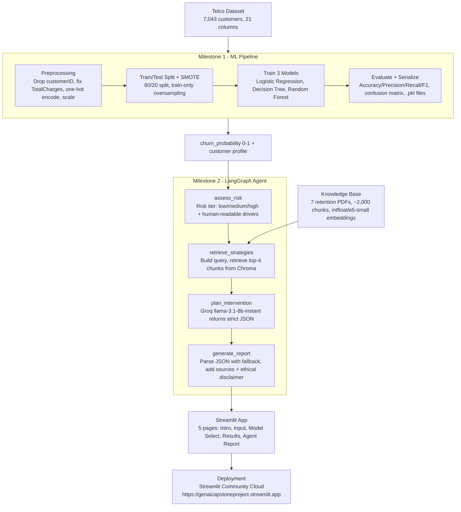

# Customer Churn Prediction & Agentic Retention Strategy

**From Predictive Analytics to Intelligent Intervention**

> A two-milestone AI system: classical ML churn prediction (Milestone 1) extended
> into a LangGraph-powered agentic retention strategist with RAG (Milestone 2).

🔗 **Live Demo:** https://genaicapstoneproject.streamlit.app
📁 **Course:** Intro to GenAI - Project 5

---

## Team Members

| Name | Enrolment No. |
|------|-------------|
| Shreyash Golhani | 2401020069 |
| Gokul VKS | 2401020094 |
| Vaageesh Kumar Singh | 2401020073 |
| Mohammad Affan Anas | 2401010280 |

---

## Project Overview

**Milestone 1** applies classical supervised machine learning (Logistic Regression,
Decision Tree, Random Forest) to the Telco Customer Churn dataset to predict
which customers are likely to leave, with an interactive Streamlit UI.

**Milestone 2** extends the system into a LangGraph agentic pipeline. The agent
autonomously assesses churn risk, retrieves evidence-based retention strategies
from a 7-document knowledge base via RAG (Chroma + sentence-transformers), plans
personalised interventions using a Groq-hosted LLM (Llama 3.1 8B), and generates
a structured retention report with sources and an ethical disclaimer.

---

## Architecture Preview (Mermaid)

> This is a concise architecture preview for quick understanding.  
> For the full node-level architecture and detailed workflow, see `Documentation/Architecture.md`.



---

## Technology Stack

| Component | Technology |
|-----------|-----------|
| ML Models | Logistic Regression, Decision Tree, Random Forest (scikit-learn) |
| Agent Framework | LangGraph |
| RAG | Chroma (local), sentence-transformers `intfloat/e5-small` |
| LLM | Groq API - `llama-3.1-8b-instant` (free tier) |
| UI | Streamlit |
| Visualisation | Plotly |
| Data | Telco Customer Churn Dataset (7,043 customers, 19 features) |

---

## Model Performance (Milestone 1)

| Model | Accuracy | Precision | Recall | F1 Score |
|-------|----------|-----------|--------|----------|
| Logistic Regression | 79.35% | 59.67% | 67.83% | 63.49% |
| Decision Tree | 77.15% | 55.24% | 72.12% | 62.56% |
| Random Forest | 79.28% | 59.06% | 70.78% | 64.39% |

Training used SMOTE oversampling on the training split. Test set: 20% holdout,
`random_state=42`.

---

## Agentic Pipeline - Milestone 2

The agent is implemented as a LangGraph `StateGraph` with four sequential nodes.
State flows through each node in order, with the full `ChurnAgentState` dict
being updated and passed forward at each step.

**Node 1 - assess_risk**: Reads the churn probability from the ML model and the
raw customer feature values. Classifies the risk tier as low (< 35%), medium
(35-65%), or high (> 65%). Extracts human-readable risk drivers such as
"month-to-month contract", "fiber optic internet", and "electronic check payment"
from the customer's feature values.

**Node 2 - retrieve_strategies**: Builds a rich semantic query from the risk
tier, contract type, tenure, and top risk drivers. Queries the Chroma vector
store (7 industry research PDFs, ~2,000 chunks) using `intfloat/e5-small`
embeddings. Returns the top 4 most relevant text chunks.

**Node 3 - plan_intervention**: Sends the customer profile and retrieved
knowledge to Groq LLM (Llama 3.1 8B) with a strict system prompt instructing
it to respond in JSON format with `risk_summary`, `recommended_actions`, and
`reasoning` keys. Temperature is set to 0.3 for consistent, factual output.

**Node 4 - generate_report**: Parses the LLM JSON output with two fallback
strategies (markdown fence stripping, heuristic brace extraction). Appends
knowledge base source previews and a hardcoded ethical disclaimer. Always
returns a structured report even if the LLM call fails.

---

## Project Structure

```
genAI_capstone_project/
|- app.py                          # 5-page Streamlit application
|- requirements.txt                # All dependencies (M1 + M2)
|- .env.example                    # Environment variable template
|- .gitignore
|- README.md
|- data/
|  |- Telco-Customer-Churn.csv    # 7,043 customer records
|- models/
|  |- logistic_regression_model.pkl
|  |- decision_tree_model.pkl
|  |- random_forest_model.pkl
|  |- scaler.pkl
|  |- model_columns.pkl
|  |- test_data.pkl               # Pre-saved test split for metrics
|  |- metrics.json                # Pre-computed evaluation scores
|- knowledge_base/                 # 7 industry retention research PDFs
|- chroma_db/                      # Pre-built Chroma vector store
|- src/
|  |- preprocessing.py            # Input preprocessing for inference
|  |- model_training.py           # Model loader
|  |- evaluation.py               # ROC curve and confusion matrix helpers
|  |- save_test_data.py           # One-time test split generator
|  |- __init.py 
|  |- agent/
|     |- __init__.py  
|     |- state.py                # LangGraph TypedDict state definition
|     |- nodes.py                # Four node functions
|     |- graph.py                # StateGraph compilation
|     |- prompts.py              # LLM prompt templates
|     |- retriever.py            # Chroma retrieval
|     |- embedder.py             # Vector store builder
|     |- document_loader.py      # PDF chunker
|     |- build_vectorstore.py    # One-time vector store builder
|     |- test_agent.py           # End-to-end integration test
|- notebook/
|  |- Telco_Customer_Churn.ipynb  # EDA, training, evaluation
|- Documentation/
   |- Report.pdf
```

---

## Setup & Running Locally

### 1. Clone and install
```bash
git clone https://github.com/Shreyashgol/genAI_capstone_project.git
cd genAI_capstone_project
pip install -r requirements.txt
```

### 2. Set up environment variables
```bash
cp .env.example .env
```
Edit `.env` and add your Groq API key. Get a free key at https://console.groq.com.

```
GROQ_API_KEY=gsk_your_key_here
USE_CHROMA_CLOUD=false
```

### 3. The vector store is already built
The `chroma_db/` folder is committed to the repo. No rebuild is needed unless
you add new PDFs to `knowledge_base/`. If you do, rebuild with:
```bash
python -m src.agent.build_vectorstore
```

### 4. Run the app
```bash
streamlit run app.py
```

### 5. Run the agent integration test
```bash
python -m src.agent.test_agent
```

---

## Deployment (Streamlit Cloud)

1. Push this repo to GitHub.
2. Go to [share.streamlit.io](https://share.streamlit.io) and connect the repo.
3. Set main file path to `app.py`.
4. Under **Settings -> Secrets**, add:
   ```toml
   GROQ_API_KEY = "gsk_your_key_here"
   USE_CHROMA_CLOUD = "false"
   ```
5. Deploy. The `chroma_db/` folder is in the repo so RAG works immediately.

---

## Application Flow

The app has 5 pages navigated via session state:

**Page 1 - Intro**: Project overview and key features. Leads to prediction.

**Page 2 - Customer Input**: 19-field form covering demographics, services, and
billing. Submits to model selection.

**Page 3 - Model Selection**: Choose between Logistic Regression, Decision Tree,
or Random Forest.

**Page 4 - Results**: Churn probability gauge, feature importance chart,
probability breakdown, model performance metrics (Accuracy/Precision/Recall/F1),
confusion matrix, and the "Generate AI Retention Strategy" button.

**Page 5 - Agent Report**: Full LangGraph pipeline output including risk badge,
risk summary, key risk drivers, numbered recommended actions, agent reasoning,
knowledge base sources, and ethical disclaimer.

---

## Ethical AI

All AI-generated retention recommendations are accompanied by an explicit
disclaimer stating that the output is decision-support for human agents, not
an autonomous decision-making system. Recommendations should be reviewed by a
qualified professional before action. Customer data must be handled per
applicable regulations (GDPR, CCPA).

---

## License

Educational project - Intro to GenAI course.
